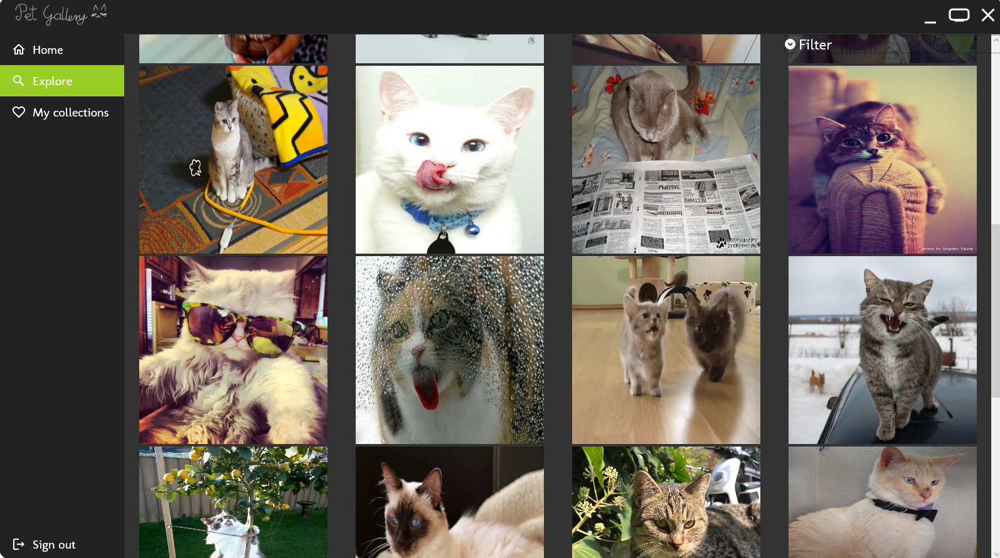

# Pet Gallery
## Table of contents
* [General info](#general-info)
* [Important note](#important-note)
* [Technologies](#technologies)
* [Setup](#setup)

## General info
The goal of Pet Gallery is to let you discover thousands of adorable cat and dog images. You can search for images matching specified criteria and create your own collections. It is possible thanks to amazing APIs: thecatapi.com and thedogapi.com. The app itself was created using C# and WPF for use on Windows. It is my first bigger project using WPF and MVVM, so the source code definitely has it's flaws, but I encourage you to check it out anyway!

## Important note
At the moment, the application is not fully completed. I'm aware of few minor bugs and there are features I would like to add in the future. However, it is usable, so I encourage you to try it out.

## Technologies
#### Technologies/Frameworks I used:
* .Net Framework v4.8
* SQLite
* WPF
* MVVM
#### APIs used:
* https://thecatapi.com/
* https://thedogapi.com/

## Setup
I recommend cloning this repo and running the project in your IDE of choice on Windows.
